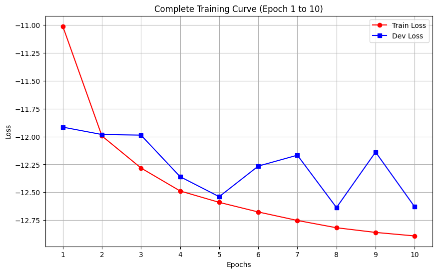
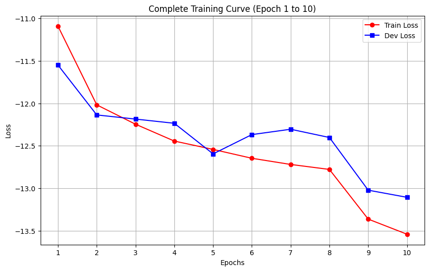

# EEB588 Final Project: Speech Denoising with Direction B (Temporal Gate)

**Author:** 汪延禧 / 1144840

## 1. Project Overview
本專案為 EEB588 期末專題，旨在基於 CWM-TCN (Channel-Wise and Spatial Feature Modulation Temporal Convolutional Network) 架構，實作並改良高質量的語音降噪模型。

在原始的 CWM-TCN 機制中，模型依賴通道特徵的跨 Slice 分流。然而，這種靜態的權重機制對「時間軸」缺乏動態控制力，導致模型在遇到「純噪音停頓段落」或「突發的非語音干擾」時，無法精準將該片段靜音，進而造成驗證集損失 (Dev Loss) 產生劇烈震盪。

為了解決此瓶頸，本專案實作了進階的 **Option B (Temporal Gate)**。在時間軸上引入了選擇性的動態閘門機制，並將其與通道循環權重完美結合，大幅提升了模型的降噪極限與收斂穩定度。

---

## 2. Core Methodology (核心方法論與架構修復)
在檢視原始程式碼時，發現原 Baseline 雖然宣告了通道權重，但並未真正落實理論中強調的「跨 Slice 循環平移 (Cyclic Shift)」機制，導致特徵分流的能力受限。

因此除了實作方向 B 的閘門外，更**同步修復了底層的 Cyclic 機制**，完美達成了完整的**三重元素相乘 (Triple Element-wise Multiply)**：
$$H_{t} = \sum h \odot w \odot g$$

1. **$w$ (Cyclic Weighting) 的修復與實作**: 引入 PyTorch 的 `th.roll` 函數，強制讓權重 `wList` 隨著 Slice 進行循環平移。這修復了原模型的缺陷，讓 $w$ 真正發揮「靜態 EQ 等化器」的作用，確保跨 Slice 的頻段分流與特徵多樣性。
2. **$g$ (Temporal Gate) 的引入**: 透過 `1x1-Conv + Sigmoid` 從局部特徵動態生成。它像是一個精準的動態音量推桿，逐一時間點 (time step) 決定訊號的通與不通，賦予模型「時間選擇性」。
3. **Fusion ($h \odot w \odot g$)**: 透過 `th.einsum` 高效實現，將原始特徵 ($h$)、修復後的循環權重 ($w$) 與時間閘門 ($g$) 完美結合。這證明了不可單獨捨棄 Cyclic，必須將動態 Gate 與靜態 Weighting 結合，才能同時兼顧音質與降噪乾淨度。

---

## 3. Repository Structure (專案架構)
本專案包含了最終執行的核心程式碼、訓練管線以及資料前處理腳本：

### 🚀 最終執行版本 (Final Core & Pipeline)
* `model_SC_CHM_Fusion_b.py`: 實作 Direction B 與修復 Cyclic 的最終核心模型。
* `trainnew_blue.py`: 訓練引擎與主程式入口。
* `trainer.py`: 負責 Training Loop、Optimizer 管理與 SI-SNR Loss 計算。
* `conf.py`: 包含 Epoch, Batch Size, Learning Rate 等超參數與資料集路徑設定。
* `dataset.py` & `audio.py`: 負責音訊檔切塊 (Chunking)、讀寫與 DataLoader 建立。
* `utils.py`: 訓練日誌與 JSON 配置檔生成工具。

### 🏛️ 對照組與歷史架構 (Baselines & History)
* `model_SC_CHM_Fusion.py`: 原始 Baseline 模型 (未加入 Gate 且缺乏 Cyclic 平移)，保留作為效能對照。
* `model.py`: 開發初期測試過的基礎架構 (包含 ConvTasNet, MB_ConvTasNet 等)，展示模型演進過程。
* `gen_scp.py`: 資料集前處理腳本 (生成 `.scp` 訓練路徑清單)。
* `train_blue.sh`: 批次訓練用的 Linux Shell 腳本紀錄。

---

## 4. Final Results & Evaluation (實驗結果)

加入 Direction B 與修復 Cyclic 後，模型在驗證集 (Dev Set) 上展現了突破性的進展：

* **圖一：Baseline 訓練曲線 (未加 Gate)**
  
  *觀察：* 缺乏時間控制的原始模型，在 Epoch 5 之後 Dev Loss 呈現不穩定的鋸齒狀震盪，極限卡在 -12.6 左右。

* **圖二：Direction B 訓練曲線 (加入 Temporal Gate & Cyclic)**
  
  *觀察：* 震盪消除！Dev Loss 平穩向下收斂，成功突破極限降至 **-13.1**。動態閘門成功壓制了停頓段落的噪音干擾。

---

## 5. Pre-trained Weights (模型權重下載)
由於 GitHub 單一檔案大小限制，訓練完成的模型權重檔 (`best.pt.tar`) 已存放於 Google Drive 供查閱與測試。
👉**[Baseline 原始模型權重]**(https://drive.google.com/drive/folders/1Ii06HW2EkIT2AK-7oy4TAcKtLIcU3vQL?usp=sharing)
👉**[Direction B 模型權重 (加入 Temporal Gate & Cyclic)]**(https://drive.google.com/drive/folders/180a0VfZWgLH9JWfwzpogxyKDyec0ZUax?usp=sharing)

---

## 6. How to Train (如何重新執行)
若需重現本專案的訓練過程，請確認 `conf.py` 中的資料集路徑，並於終端機執行以下指令：

```bash
python trainnew_blue.py \
    --gpus 0 \
    --epochs 50 \
    --batch-size 2 \
    --num-workers 0 \
    --checkpoint /path/to/your/checkpoint_dir
